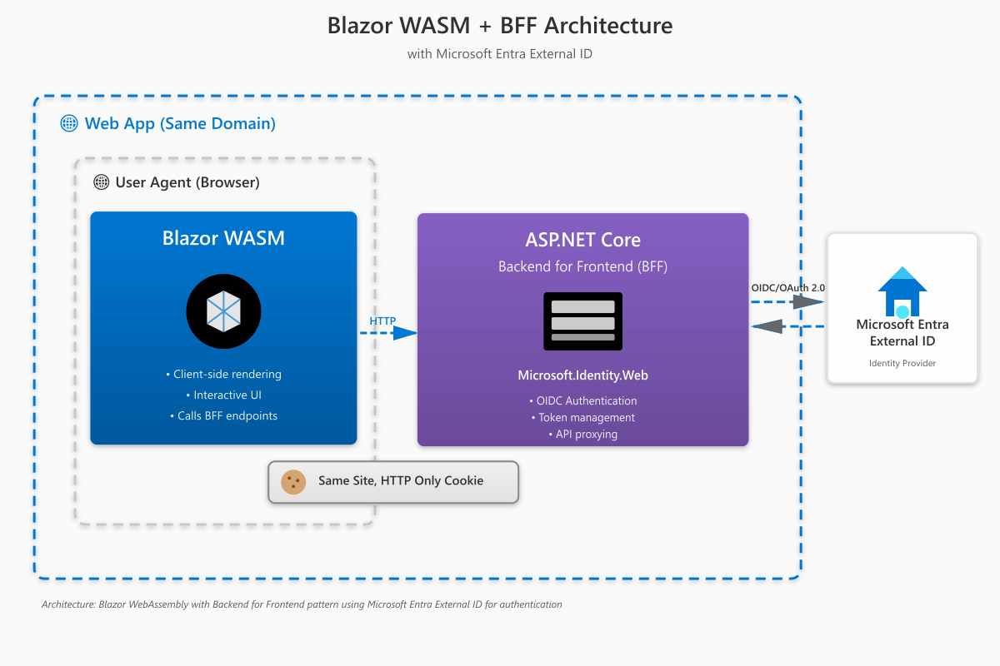

# Blazor.BFF.EntraExternalID.Template

[](https://www.nuget.org/packages/Blazor.BFF.EntraExternalID.Template/)

This template can be used to create a Blazor WASM application hosted in an ASP.NET Core Web app using Microsoft Entra External ID and Microsoft.Identity.Web to authenticate using the BFF (Backend for Frontend) security architecture. This approach implements server-side authentication, removing tokens from the browser and using secure HTTP-only cookies with each request/response. The template includes MudBlazor for a modern UI framework and implements security headers following best practices for Blazor applications.



## Features

- ✅ **WASM hosted in ASP.NET Core 8**
- ✅ **BFF with Microsoft Entra External ID** using Microsoft.Identity.Web
- ✅ **MudBlazor UI framework** for modern and responsive interface
- ✅ **OAuth2 and OpenID Connect (OIDC)** authentication
- ✅ **No tokens in the browser** - secure cookie-based authentication
- ✅ **Continuous Access Evaluation (CAE)** support - see [CAE Usage Guide](CaeUsage.md)
- ✅ **Security headers** implementation for enhanced protection

## Using the Template

### Install

```bash
dotnet new install Blazor.BFF.EntraExternalID.Template
```

### Run

```bash
dotnet new blazor-bff-ext -n YourCompany.Bff
```

Use the `-n` or `--name` parameter to change the name of the output created. This string is also used to substitute the namespace name in the `.cs` files for the project.

## Setup After Installation

### Configure Entra External ID Settings

Add your Microsoft Entra External ID app registration settings to `appsettings.json`:

```json
{
  "EntraExternalID": {
    "Instance": "https://--your-domain--.ciamlogin.com/",
    "Domain": "[Enter the domain of your Entra External tenant, e.g. contoso.onmicrosoft.com]",
    "TenantId": "[Enter the Tenant Id obtained from Azure portal, e.g. da41245a5-11b3-996c-00a8-4d99re19f292]",
    "ClientId": "[Enter the Client Id (Application ID) obtained from Azure portal, e.g. ba74781c2-53c2-442a-97c2-3d60re42f403]",
    "ClientSecret": "[Copy the client secret added to the app from Azure portal]",
    "ClientCapabilities": ["cp1"],
    "CallbackPath": "/signin-oidc",
    "SignedOutCallbackPath": "/signout-callback-oidc",
    "SignedOutRedirectUri": "https://localhost:5001/"
  }
}
```

### Key Configuration Parameters

| Parameter                 | Description                                                                              |
| ------------------------- | ---------------------------------------------------------------------------------------- |
| **Instance**              | Your Entra External ID tenant login endpoint (e.g., `https://yourtenant.ciamlogin.com/`) |
| **Domain**                | Your Entra External ID tenant domain                                                     |
| **TenantId**              | Your tenant identifier from Azure portal                                                 |
| **ClientId**              | Application (client) ID from app registration                                            |
| **ClientSecret**          | Client secret generated in app registration (store in user secrets for production)       |
| **ClientCapabilities**    | Set to `["cp1"]` to enable Continuous Access Evaluation (CAE)                            |
| **CallbackPath**          | OAuth callback path (default: `/signin-oidc`)                                            |
| **SignedOutCallbackPath** | Post-logout callback path                                                                |
| **SignedOutRedirectUri**  | URI to redirect after sign-out                                                           |

### Continuous Access Evaluation (CAE)

This template includes built-in support for Continuous Access Evaluation, enabling real-time enforcement of security policies such as:

- Instant access revocation when user accounts are disabled
- Authentication context requirements for sensitive operations
- Location-based access control

For detailed CAE implementation guide, see **[CAE Usage Guide](CaeUsage.md)**.

### Uninstall

```bash
dotnet new uninstall Blazor.BFF.EntraExternalID.Template
```

## Development

### Build Template Package

Reference: [Create a custom template for dotnet new](https://docs.microsoft.com/en-us/dotnet/core/tutorials/create-custom-template)

```bash
nuget pack content/Blazor.BFF.EntraExternalID.Template.nuspec
```

### Install Development Version

From locally built nupkg:

```bash
dotnet new install Blazor.BFF.EntraExternalID.Template.1.0.0.nupkg
```

From local folder:

```bash
dotnet new install <PATH>
```

Where `<PATH>` is the path to the folder containing `.template.config`.

## Microsoft Entra External ID Documentation

- [Microsoft Entra External ID Overview](https://learn.microsoft.com/en-us/entra/external-id/)
- [Register an application in Entra External ID](https://learn.microsoft.com/en-us/entra/external-id/customers/how-to-register-ciam-app)
- [Quickstart: Add sign-in to a web app](https://learn.microsoft.com/en-us/entra/external-id/customers/quickstart-web-app-dotnet-sign-in)

## Architecture: BFF (Backend for Frontend) Pattern

The BFF pattern provides several security benefits:

- **Token Management**: Access tokens are managed server-side, never exposed to the browser
- **Cookie-Based Auth**: Uses secure, HTTP-only, SameSite cookies
- **Reduced Attack Surface**: No tokens in JavaScript means no XSS token theft
- **Centralized Security**: Authentication and authorization logic centralized in the backend
- **API Gateway**: BFF acts as a secure gateway to downstream services

## Credits & Dependencies

### NuGet Packages

- **Microsoft.Identity.Web** - Microsoft authentication library
- **Microsoft.Identity.Web.UI** - UI components for authentication
- **MudBlazor** - Material Design component framework for Blazor
- **NetEscapades.AspNetCore.SecurityHeaders** - Security headers middleware
- **ASP.NET Core 8.0** standard packages

### Special Thanks

- [Damien Bowden](https://github.com/damienbod) - Original BFF templates for Azure B2C and Azure AD
- MudBlazor Team - Modern Blazor component library

## Links

- [Microsoft.Identity.Web GitHub](https://github.com/AzureAD/microsoft-identity-web)
- [MudBlazor Documentation](https://mudblazor.com/)
- [BFF Security Pattern](https://datatracker.ietf.org/doc/html/draft-ietf-oauth-browser-based-apps)

## Contributing

Contributions are welcome! Please feel free to submit a Pull Request.

## License

This project is licensed under the MIT License - see the [LICENSE](LICENSE) file for details.

---

## Support

For issues, questions, or contributions, please visit the [GitHub repository](https://github.com/yourusername/Blazor.BFF.EntraExternalID.Template).
